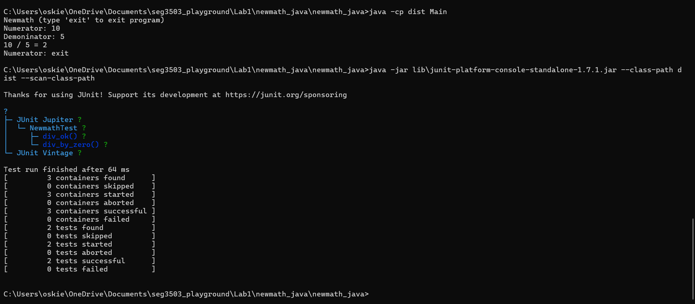
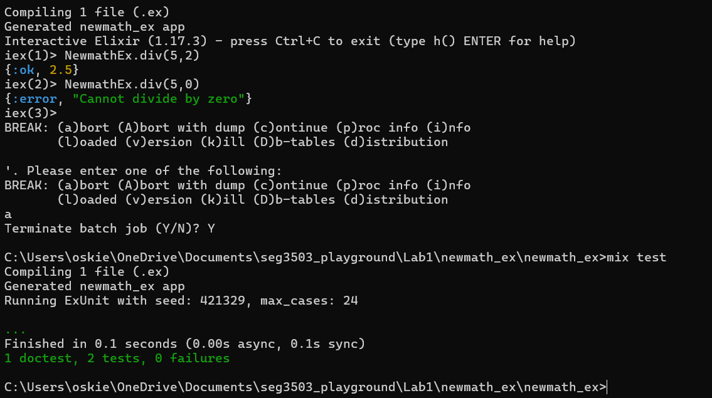

# seg3503_playground

| Outline    | Value              |
|------------|--------------------|
| Course     | SEG 3503           |
| Student    | Oscar Barbieri     |
| GitHub     | https://github.com/OscarBarbieri/seg3503_playground |

---

## Lab 1

### Java (Newmath)

**To run:**
```
cd Lab1/newmath_java/newmath_java
javac -encoding UTF-8 --source-path src -d dist src\*.java
java -cp dist Main
```

**To test:**
```
javac -encoding UTF-8 --source-path src -d dist -cp "dist;lib\junit-platform-console-standalone-1.7.1.jar" test\*.java
java -jar lib\junit-platform-console-standalone-1.7.1.jar --class-path dist --scan-class-path
```

### Elixir (Newmath)

**To run:**
```
cd Lab1/newmath_ex/newmath_ex
iex -S mix
```
Then in iex:
```
NewmathEx.div(5,2)
NewmathEx.div(5,0)
```

**To test:**
```
mix test
```

---

## Screenshots

### Java Run & Test


### Elixir Run & Test

